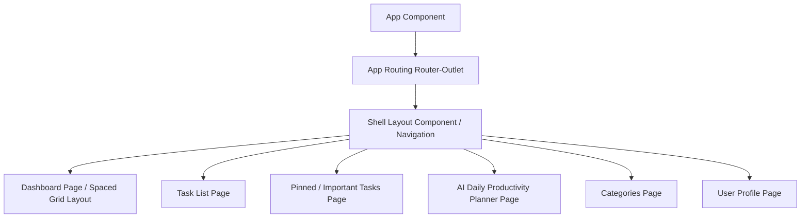

# Smart Task Management System (Do IT) — Frontend client

A premium, highly interactive client dashboard application for the **Do IT** task management platform, built using **Angular 20** and styled with a custom modern design system.

---

## 🎨 Design & Aesthetic Philosophy

The frontend is styled using custom **Vanilla CSS** with a curated HSL color palette to provide a stunning, fluid user experience:
- **Glassmorphism**: Translucent floating card headers, containers, and dialog modals using `backdrop-filter: blur(20px)` and soft outer shadow vectors.
- **Dynamic Glow Blobs**: Subtle theme-tinted background ambient lighting blobs (`.auth-page__glow`) that follow color-mix primary/tertiary systems.
- **Micro-Animations**: Smooth scale transitions, focus indicator animations, and responsive flex grids.
- **Mobile Responsive Design**: Clean grid scaling and automatic folding of the promotional panels on smaller/mobile screen sizes (widths $< 959\text{px}$) to display a centered, premium logo branding header on authentication cards.

---

## 🏗️ Technical Architecture

- **Angular 20**: Standalone components, modern inject-based dependency injection, and strict type safety.
- **State Management & Signals**: Lightweight Reactive Signals (`signal`, `computed`, `effect`) and `toSignal` RxJS interoperability for real-time search debouncing and automatic filtered task list updates.
- **Angular Material**: Custom styling wrappers around Material card panels, navigation panels, interactive inputs, menus, and Dialog overlay panels.
- **Real-Time Input Validation**: Real-time whitespace trimming on field `(blur)` events across all inputs and forms, accompanied by strict verification to block empty/whitespace-only form submissions.
- **Local Account Cache**: Secure local storage cache (`knownAccounts`) allowing users to easily select and sign in to recently active accounts on the device.

---

## 🌟 Application Structure



---

## ⚙️ Development & Server Deployment

### Prerequisites
- **Node.js**: Version 20.x or higher.
- **Angular CLI**: Version 20.3.1.

### Setup and Running Locally
1. Install project dependencies:
   ```bash
   npm install
   ```
2. Start the local development server:
   ```bash
   npm start
   ```
3. Open your browser and navigate to `http://localhost:4200/`. The application will hot-reload whenever you modify any source files.

### Production Build
To compile the project and bundle optimized assets for deployment:
```bash
npm run build
```
The output will be generated inside the `dist/tms-frontend` directory.
